<a href="https://persieahmad.github.io">
  
</a>

<p align="center">
  <a href="https://persieahmad.github.io"></a>&nbsp;
  <a href="https://www.linkedin.com/in/persieahmad"></a>&nbsp;
  <a href="mailto:ahmadsadiq885@gmail.com"></a>
</p>

### 👋 Hi, I'm Ahmad

Senior Frontend Engineer at **Target** with **5.5+ years** building and scaling high-traffic e-commerce and membership platforms for **100M+ users**.
I focus on **web performance and Core Web Vitals**, **config-driven UI**, and **cross-platform (Web · iOS · Android) component systems**, and I measure the work in business outcomes.

### ⚡ Impact highlights

| Result | How |
|:--|:--|
| 📈 **+71%** registration completion | Circle 360 load time cut from ~5–6s to ~2–3s, A/B tested |
| 📦 **−99.7%** route JS bundles | Code-splitting on high-traffic pages, SSR/SEO preserved |
| 🎙️ **+12%** cart adds | Voice search for target.com, built during Innovation Week |
| 🚀 **~30%** faster time-to-market | Loyalty experiences migrated to Config Driven UI |
| 📐 **CLS 0.841 → 0.009** | Gift Registry, with skeleton loading states |
| 🤖 **codehealthbot** | AI-powered bot that opens fix PRs across nearly all Web repos weekly |

### 🧑‍💻 About me

```ts
export const ahmad = {
  role: 'Senior Frontend Engineer',
  company: 'Target',
  location: 'Bengaluru, India',
  focus: ['Core Web Vitals', 'Config Driven UI', 'Micro-frontends', 'SSR / App Router'],
  aiTooling: ['Claude Code', 'GitHub Copilot', 'Codex'],
  motto: 'Ship fast. Measure faster.',
} satisfies Engineer;
```

### 🛠️ Tech stack

<p>
  
  
  
  
  
  
  
  
  
</p>
<p>
  
  
  
  
  
  
  
  
</p>
<p>
  
  
  
  
  
  
</p>

### 🏆 Recognition

- **Monthly Spot Award**: Ownership, Innovation & Impact (Aug 2026), Target
- **Pyramid Award**, Target

---

<p align="center"><sub>More on my work at <a href="https://persieahmad.github.io">persieahmad.github.io</a></sub></p>
